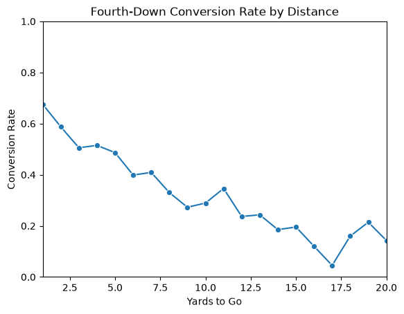
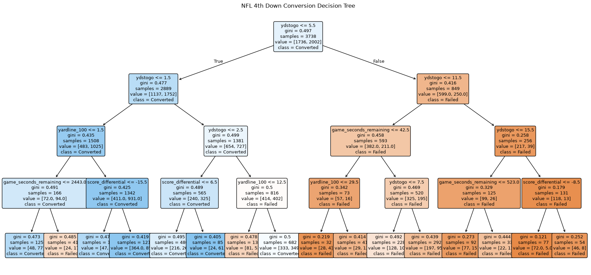
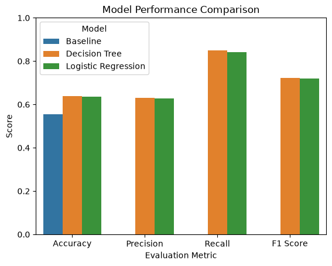
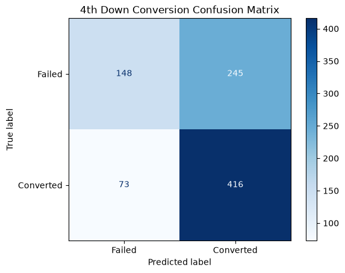
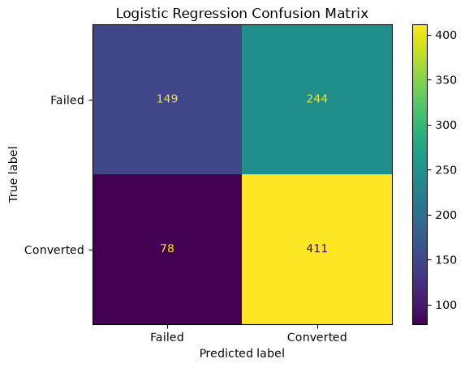
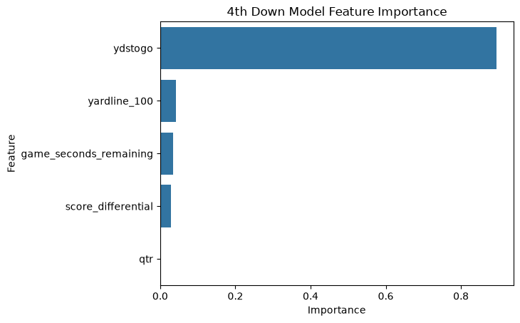

# Predicting NFL Fourth-Down Conversions Using Machine Learning

## Problem Definition

Fourth-down decisions are an important part of NFL strategy. When an offense attempts to convert on fourth down, a successful play allows the team to maintain possession, while a failed attempt typically gives possession to the opposing team.
The goal of this project is to determine whether game situation variables can be used to predict whether an NFL fourth-down attempt will be successful.

The target variable, `converted`, is binary:

- `1` represents a successful fourth-down conversion.
- `0` represents a failed fourth-down attempt.

Two classification models were developed and compared: a Decision Tree Classifier and Logistic Regression.

---

## Background and Context

Fourth-down attempts provide an interesting prediction problem because the offense must gain a specific number of yards to continue the drive. The difficulty of an attempt can change depending on factors such as the number of yards needed, field position, score differential, and time remaining.
A model capable of predicting fourth-down success could be useful when analyzing offensive decision making. However, this project focuses specifically on predicting whether a fourth-down attempt will be successful rather than determining whether a team should attempt the conversion.

---

## Data Description

NFL play by play data from the 2020 through 2025 regular seasons were used for this project.

After filtering the data to fourth-down rushing and passing attempts, the initial dataset contained 4,622 plays. Two observations without a defined successful or failed outcome were removed, leaving 4,620 fourth-down attempts** for analysis.

Each observation represents one fourth-down attempt.

The target variable is `converted`, and five game-situation variables were selected as predictors:
ydstogo: Yards required to gain a first down 
yardline_100: Distance from the opponent's end zone 
score_differential: Difference between the possessing team's score and opponent's score 
qtr: Quarter in which the play occurred
game_seconds_remaining: Time remaining in the game 

The overall fourth-down conversion rate in the dataset was approximately 53.9%.

---

## Data Understanding and Exploration

One of the clearest relationships in the data was between yards to go and fourth-down conversion success.

The conversion rate generally decreases as the number of yards required for a first down increases. Short yardage situations had much higher conversion rates, while longer attempts became increasingly difficult to convert.
There is some variation at longer distances. These situations occur less frequently, so their conversion rates can vary more because they are based on fewer observations. Overall, the exploratory analysis suggests that yards to go may be one of the most important predictors of fourth-down success.

---

## Data Preparation and Feature Selection

The original play-by-play data were filtered to regular season fourth-down rushing and passing attempts. Plays without a clearly defined conversion outcome were removed, and the `converted` variable was created to represent whether each attempt succeeded or failed.

Five features were selected:

- ydstogo
- yardline_100
- score_differential
- qtr
- game_seconds_remaining

These variables were selected because they describe the game situation at the time of the fourth-down attempt. To separate the training and testing data, plays from the 2020 through 2024 seasons were used to train the models. Plays from the **2025 season** were then used as the test set.
This allowed the models to learn from previous seasons before being evaluated on a later season that was not used during training.

---

## Baseline and Model Development

Before training the machine learning models, a baseline was established using the most common outcome in the test data. The baseline achieved an accuracy of 55.4%. This provides a benchmark for determining whether the machine-learning models actually improve upon a simple prediction.

Two classification models were then developed:

1. Decision Tree Classifier
2. Logistic Regression

### Model 1: Decision Tree

The first model was a Decision Tree Classifier. A Decision Tree creates a series of rules using the predictor variables to separate observations into predicted conversions and failures.

The first split in the tree uses `ydstogo`, separating attempts based on whether approximately 5.5 yards or fewer were required. Distance continues to appear throughout the tree, suggesting that the number of yards needed plays an important role in predicting conversion success.

### Model 2: Logistic Regression

The second model was Logistic Regression.

Logistic Regression is appropriate for this project because the target has two possible outcomes: converted or failed. The model uses the selected game situation variables to classify each fourth-down attempt.
Using two different classification models also makes it possible to compare their performance on the same 2025 test data.

---

## Model Evaluation and Selection

The models were evaluated using four classification metrics:

- Accuracy: The percentage of all predictions that were correct.
- Precision: When the model predicted a conversion, how often that prediction was correct.
- Recall: The percentage of actual successful conversions correctly identified by the model.
- F1 Score: A combined measure that balances precision and recall.

The results of the two models were also compared with the baseline.

Both machine-learning models performed better than the baseline.
The results of the Decision Tree and Logistic Regression were also very similar. However, the Decision Tree produced slightly higher accuracy, precision, recall, and F1 scores.
Because it performed best across all four evaluation metrics, the Decision Tree was selected as the final model.

### Decision Tree Confusion Matrix

The Decision Tree correctly predicted **148 failed attempts** and **416 successful conversions**.

It also incorrectly predicted 245 failed attempts as conversions and missed 73 actual conversions.

The model's **85.07% recall** means that it successfully identified a large majority of the fourth-down attempts that actually converted. However, the lower precision shows that the model also predicted conversions for a considerable number of plays that ultimately failed.

### Logistic Regression Confusion Matrix

Logistic Regression produced similar results. It correctly predicted **149 failed attempts** and **411 successful conversions**.

The model incorrectly predicted 244 failed attempts as conversions and missed 78 actual successful conversions.

The similarities between the two confusion matrices help demonstrate how closely the two models performed.

---

## Model Interpretation and Insights

One advantage of the Decision Tree is the ability to examine which features were most important to its predictions.

The feature-importance results show that **`ydstogo` was by far the most important predictor** in the Decision Tree.

Field position, time remaining, and score differential contributed much less to the model, while quarter had very little importance.

This result supports what was observed during the exploratory analysis. As the number of yards required for a first down increased, the conversion rate generally decreased.

The exploratory analysis and machine-learning results therefore point toward the same conclusion: **distance is the strongest of the five variables used in this project for predicting fourth-down conversion success.**

---

## Limitations, Ethics, and Reflection

Although both models outperformed the baseline, an accuracy of approximately 64% demonstrates that fourth-down success cannot be completely explained by the five variables included in this project.

The models do not account for several factors that could affect the outcome of an individual play, including:

- Offensive and defensive personnel
- Play call
- Quarterback or team quality
- Defensive formation
- Injuries
- Weather
- Individual player performance

There is also an important difference between predicting whether a fourth down will succeed and determining whether a team should attempt it.
This project addresses only whether the attempt is likely to succeed. A complete fourth-down decision model would also need to consider alternatives such as punting or attempting a field goal and how each decision affects a team's chances of winning.

---

## Conclusion

This project examined whether game-situation information could be used to predict NFL fourth-down conversions.
Both machine-learning models improved upon the 55.4% baseline, with each achieving approximately 64% accuracy.
The Decision Tree produced slightly better results than Logistic Regression across accuracy, precision, recall, and F1 score and was therefore selected as the better model.
One of the clearest findings from the project was the importance of yards to go. Both the exploratory analysis and Decision Tree showed that distance was strongly associated with conversion success. Short fourth-down attempts were substantially easier to convert than longer attempts.
At the same time, the models demonstrate that fourth-down success is more complicated than distance and basic game situation alone. Future versions of the model could incorporate additional information about teams, players, and individual play characteristics to determine whether predictive performance can be improved.

---

## Code, Data, and Transparency

The complete Python analysis and machine-learning workflow can be viewed in the project's Jupyter Notebook.
**[View the Final Jupyter Notebook](https://github.com/MatthewThow/data-structures-portfolio/blob/main/notebooks/4thdownmodel_MatthewThow.ipynb)**

**Data Source:** NFL play-by-play data were obtained from the nflverse/nflfastR dataset.
